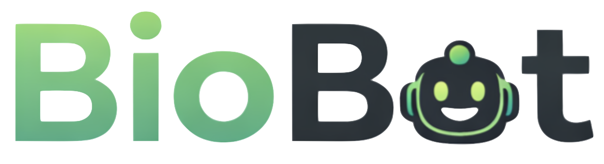

<p align="center">
  
</p>

<p align="center">
  <strong>AI-powered protocol generation for liquid handling robots</strong>
</p>

<p align="center">
  <em>Ask a quesiton or describe your experiment in plain English and get an answer or executable code for your liquid handler.</em>
</p>

---

BioBot is a web-based assistant that generates, validates, and iterates on automation protocols for liquid handling robots. It combines a conversational chat interface with a RAG (Retrieval-Augmented Generation) pipeline, an interactive deck visualizer, and a code validation loop to produce working scripts from natural language descriptions. 
It helps users interact with an AI assistant to get guidance, protocols, and Python code for automating lab workflows.

---

## Features

### Protocol Generation
- **Natural language → working code.** Describe what you want ("serial dilution, 1:10, 8 steps, 96-well plate") and BioBot generates a complete, executable protocol.
- **Structured clarification.** When details are missing, BioBot presents interactive multiple-choice questions (platform, pipette, labware, volumes) instead of asking free-text follow-ups. Answer once, then the code generates.
- **Self-correcting generation loop.** Generated code is automatically simulated. If it fails, errors are fed back to the LLM for correction (up to 3 attempts) before delivering the final result.
- **Reverse semantic check.** After simulation passes, a second LLM call verifies that the code actually matches what the user asked for, not just that it runs without errors.

### Interactive Deck Visualizer
- **Split-screen deck layout** alongside the chat, showing the robot's worktable with all labware, pipettes, and modules.
- **Platform-adaptive rendering.** OT-2 shows a 4×3 grid, Hamilton shows a linear worktable with carriers on tracks, Echo shows dual source/destination plate maps.
- **Click, double-click, and drag-and-drop** to move labware, swap slots, change instruments, and edit parameters. The code updates in real time.
- **Automatic coherence.** Changing a pipette auto-updates the tiprack; changing labware validates well references; volume edits are checked against pipette ranges.

### User Feedback Loop
- **Thumbs up (👍)** on a code block saves it as a verified working protocol into the documentation folder for the corresponding platform. Future generations retrieve these as examples via RAG.
- **Thumbs down (👎)** opens a remark field where you describe what went wrong. The failed code + your notes are saved as negative examples, teaching the system what to avoid.
- The RAG index rebuilds automatically after each feedback action, the system improves with every use.

### Authentication & Security
- User registration with hashed passwords.
- API key encryption at rest using Fernet symmetric encryption.
- Chat message encryption using a server-side key.

---

## How Code Generation Works

When a user asks BioBot for a protocol, the request goes through a multi-stage pipeline that classifies the intent, gathers missing information, retrieves relevant documentation, generates code, and validates it, all before the user sees a single line of output.

**Classification.** The user's message is first sent to a lightweight LLM (GPT-4o-mini) that classifies it as one of three categories: *code* (the user wants a protocol script), *general* (a question about lab automation that doesn't require code), or *out* (unrelated to lab automation). General and out-of-scope messages are handled by a standard streaming chat response. Code requests enter the RAG pipeline.

**Sufficiency check.** Before generating anything, a second LLM call evaluates whether the request contains enough information to produce a working protocol. It considers the full conversation history, if the user mentioned "Opentrons OT-2" three messages ago, the system remembers. When details are missing, the LLM returns a structured JSON object describing the questions it needs answered, each with predefined options. The frontend renders these as an interactive stepper form: the user selects answers one at a time (radio buttons for single-choice, checkboxes for multi-choice, with an "Other" text field for custom values), then clicks "Generate Protocol." The compiled answers are sent back as a single message that skips the sufficiency check entirely, going straight to code generation.

**Consolidation.** Multi-turn conversations are common, the user might say "serial dilution" in the first message, then "use a P300" in a follow-up, then answer the structured questions in a third. Before retrieval, a consolidation step merges the entire conversation into one self-contained protocol description, as if the user had provided everything upfront. This ensures the RAG retrieval and code generation see the complete picture regardless of how the conversation unfolded.

**Retrieval.** The consolidated request is embedded using OpenAI's text-embedding model and searched against a FAISS vector index built from the platform's documentation (API references, labware guides, example protocols, and user-verified working code from the feedback system). The top-K most relevant documentation chunks are retrieved and injected into the generation prompt as context.

**Generation.** The LLM receives the consolidated request, the retrieved documentation chunks, and a system prompt tailored to the detected platform. It generates a complete protocol script.

**Simulation and validation.** The generated code goes through a validation step to catch errors before reaching the user. When a platform-specific simulation tool is available, BioBot runs the code against it, validating labware definitions, instrument constraints, and deck configuration without touching any hardware. When no simulator is available, BioBot falls back to an LLM-based validation: the generated script is compared against reference protocols, official documentation, and verified working code retrieved from the RAG index. The LLM checks for API misuse, invalid function calls, incompatible hardware combinations, and logical errors (such as aspirating more volume than a well contains or referencing a labware position that doesn't exist). If either validation method reports errors, the error details are fed back to the LLM along with the original code and request, and the generation step repeats. This correction loop runs up to 3 times, producing progressively cleaner output with each iteration.

**Reverse check.** Once the simulation passes, one final LLM call compares the generated code against the user's original request to verify semantic correctness. A protocol that runs without errors but performs the wrong experiment is caught here. If the reverse check suggests corrections, they are applied and re-simulated.

**Streaming.** The final validated code is streamed to the browser token-by-token. Throughout the pipeline, status messages ("Analyzing your request...", "Searching documentation...", "Attempt 2.. correcting errors...") are streamed to the frontend so the user sees progress in real time rather than a silent wait.

---

## Getting Started

### Prerequisites

- Docker and Docker Compose
- An OpenAI API key

### 1. Clone the repository

```bash
git clone https://github.com/brsynth/BioBot.git
cd BioBot
```

### 2. Configure environment variables

Create a `.env` file at the project root:

```bash
# Database
DB_HOST=postgres
DB_PORT=5432
DB_NAME=biobotdb
DB_USER=biobotuser
DB_PASSWORD=your_db_password

# OpenAI
API_KEY=your_openai_api_key

# Flask
FLASK_SECRET_KEY=your_random_secret_key

# Email for password reset (optional, pick one)
#
# Option A: Resend (recommended : no email account needed)
#   1. Sign up at https://resend.com (free tier: 100 emails/day)
#   2. Go to API Keys in the dashboard and create a new key
#   3. Paste it below
RESEND_API_KEY=re_your_resend_key
#
# Option B: SMTP (Gmail, Outlook, or any SMTP server)
#   For Gmail: enable 2FA, then generate an App Password
#   at https://myaccount.google.com/apppasswords
# SMTP_HOST=smtp.gmail.com
# SMTP_PORT=587
# SMTP_USER=your_email@gmail.com
# SMTP_PASSWORD=your_16char_app_password
```

### 3. Build and start

```bash
docker compose build
docker compose up -d
```

### 4. Access the app

```
http://localhost:5000
```

### 5. Check logs

```bash
docker compose logs -f biobot
```

---

## Project Structure

```
BioBot/
├── biobot/
│   ├── app.py                  # Flask application all routes
│   ├── engine.py               # LLM orchestration : classify, stream, RAG dispatch
│   ├── main_rag.py             # RAG pipeline : embed, search, generate, simulate, correct
│   ├── config.py               # Database, API keys, init_db
│   ├── crypt.py                # Encryption utilities (Fernet)
│   ├── deck_parser.py          # Protocol code → deck state JSON (regex + LLM fallback)
│   ├── email_service.py        # SMTP / Resend email sending
│   ├── llm_provider.py         # Provider-agnostic LLM interface
│   ├── handlers.json           # Platform handler configuration
│   ├── templates/
│   │   ├── index.html          # Main chat interface
│   │   ├── login.html
│   │   ├── register.html
│   │   ├── forgot_password.html
│   │   └── reset_password.html
│   └── static/
│       ├── style.css           # Main stylesheet
│       ├── auth.css            # Authentication pages
│       ├── questions.css       # Structured questions UI
│       ├── script.js           # Chat logic, streaming, history
│       ├── deck_renderer.js    # LLM based deck generator
│       ├── echo_renderer.js    # Echo 650 plate map visualizer
│       ├── hamilton_renderer.js # Hamilton STAR worktable visualizer
│       ├── ot2_catalog.js      # OT-2 hardware catalog
│       ├── hamilton_catalog.js  # Hamilton hardware catalog
│       ├── deck_coherence.js   # Pipette/tiprack/volume validation
│       ├── deck_params.js      # Protocol parameter editor
│       ├── questions_renderer.js # Structured question stepper UI
│       └── logo.png
├── docs/                       # Platform documentation for RAG
│   ├── opentrons/
│   │   ├── codes/              # User-verified working protocols
│   │   └── failed_codes/       # User-reported failures
│   ├── hamilton/
│   └── echo/
├── tests/                      # Pytest test suite
├── docker-compose.yml
├── Dockerfile
├── requirements.txt
└── .env
```

---

## Usage

1. **Register** a new account or log in.
2. **Start a chat** and describe your protocol in plain English.
3. If BioBot needs more details, it presents **structured questions** select your options and click "Generate Protocol."
4. BioBot generates, simulates, and validates the code automatically.
5. The final code appears with **Copy**, **Download**, and **Deck** buttons.
6. Click **Deck** to see the interactive deck layout, drag labware, change instruments, edit parameters.
7. Test the code on your robot. Click **👍** if it works, **👎** if it doesn't (with a note about what went wrong). Your feedback improves future generations.

---

## Documentation for RAG

Place your platform documentation in the `docs/` directory:

```
docs/
├── opentrons/          # .rst, .txt, .pdf, .csv files
│   ├── api_reference.rst
│   ├── labware_guide.txt
│   ├── codes/          # Populated by positive feedback
│   └── failed_codes/   # Populated by negative feedback
├── hamilton/
└── echo/
```

On first run, BioBot chunks the documentation, embeds it, and builds a FAISS index (saved as `rag_store.pkl`). Subsequent runs load the cached index. The cache is automatically invalidated when users submit feedback.

---